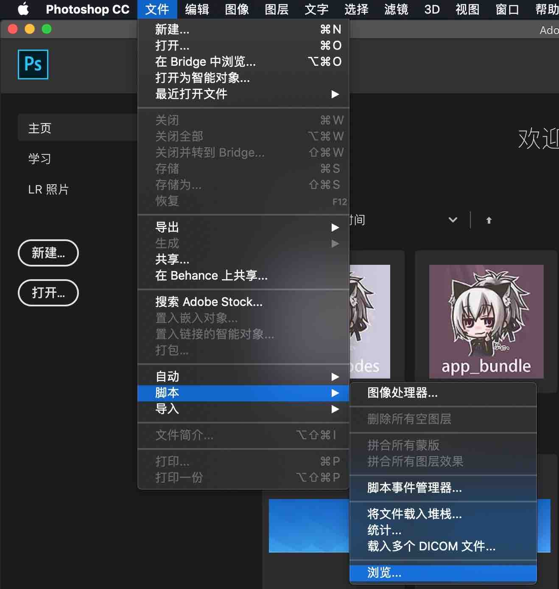
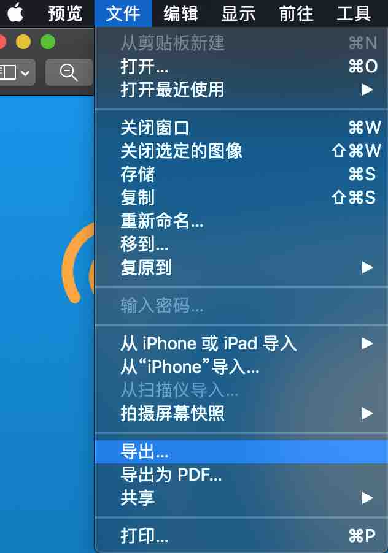
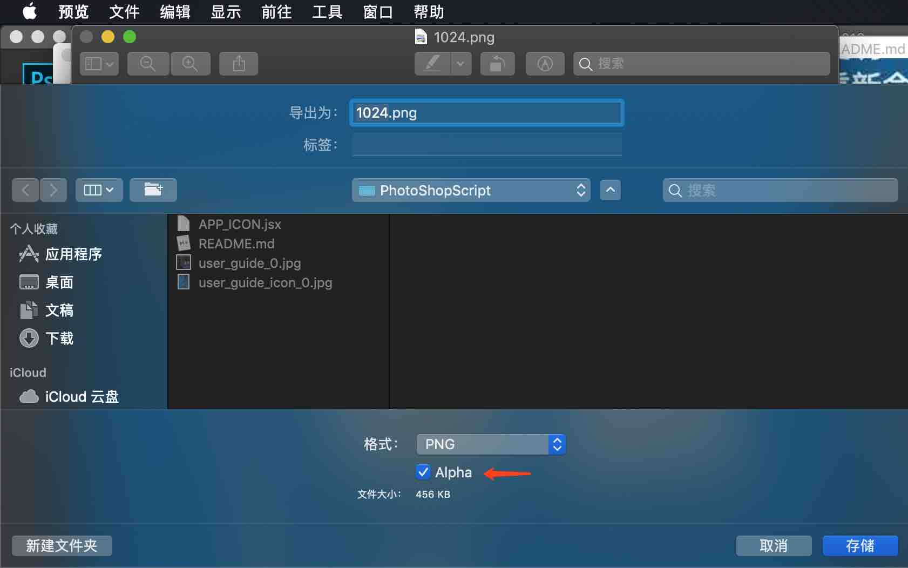

# PhotoShopScript

  

### 基础介绍

本仓库包含一些可以在 *PhotoShop* 上运行的脚本文件，可以为开发者和设计师提供相应的便利功能。

### 基础使用方法

以在 *macOS Mojave 10.14.5* 系统上运行的 *Adobe PhotoShop CC 2019* 为例：

* 第一步，打开 *PhotoShop CC*。

* 第二步，从屏幕上方的菜单栏中找到 *文件* 选项卡，依次选择 *文件 -> 脚本 -> 浏览...* ，这一路径根据系统和应用版本不同可能会有所不同，如图所示：

  

* 最后，选择您想要运行的脚本文件，点击 *打开* ，根据脚本的指示完成后续操作。

### 脚本介绍

* **APP_ICON.jsx**

  * **一句话说明**  

    * 快速生成所有尺寸的 APP ICON 文件。

  * **详细介绍**

    * 默认会一并输出 iOS 与 Android 的 ICON，Adnroid 的 ICON 文件名会以``ic_launcher``开头，iOS 的 ICON 文件名为纯数字。
    * 生成新文件时，会覆盖输出目录下的同名文件，建议新建一个文件夹来接收输出的文件。

  * **注意事项**

    * 对于 iOS 而言，截至``iOS 12.3.1  Xcode 10.2.1`` ，苹果上架审核要求 ICON 不需要自带圆角，并且不能有透明通道，但实践中我发现某些情况下 UI 设计工具设置正确，但输出的 png 可能依然包含 alpha，这里对于使用 *macOS* 系统的用户提供一种便捷的检查方式：

      * 第一步，双击 png 文件，使用 *macOS* 系统自带的 *预览* 程序打开图片。

      * 第二步，从屏幕上方的菜单栏中找到 *文件* 选项卡，依次选择 *文件 -> 导出...* ，如图所示：

        

      * 第三步，观察出现的页面中是否存在 alpha 选项，如图所示：

        

      * 如果出现了 alpha 选项，证明当前的 png 图片还存在透明通道，只需要将 alpha 选项的对勾去掉，并选择位置后点击 *存储* ，即可生成正确无误的 png 图片。

      * 如果没有出现 alpha 选项，则无需进行任何处理。

* **APP_LaunchImage.jsx**

  * 暂不够完善，稍晚发布

### 开发资源

* [Adobe PhotoShop Scripting](https://www.adobe.com/devnet/photoshop/scripting.html)
  * 主要以 pdf 的形式提供 *Guide* 和 *Reference*，支持 *AppleScript*，*JavaScript* 和 *VBScript* 三种语言。

* [Adobe I/O](<https://www.adobe.io/>)
  * *Adobe* 重构并整合了它的资源，推出了一个新的开发者官网，其中主要分为 *Experience Platform* 和 *Adobe I/O Runtime* 两部分，而脚本与工具插件开发属于后者。

### LICENSE

[WTFPL](<http://www.wtfpl.net/about/>) – JUST DO WHAT THE F*CK YOU WANT TO DO.

