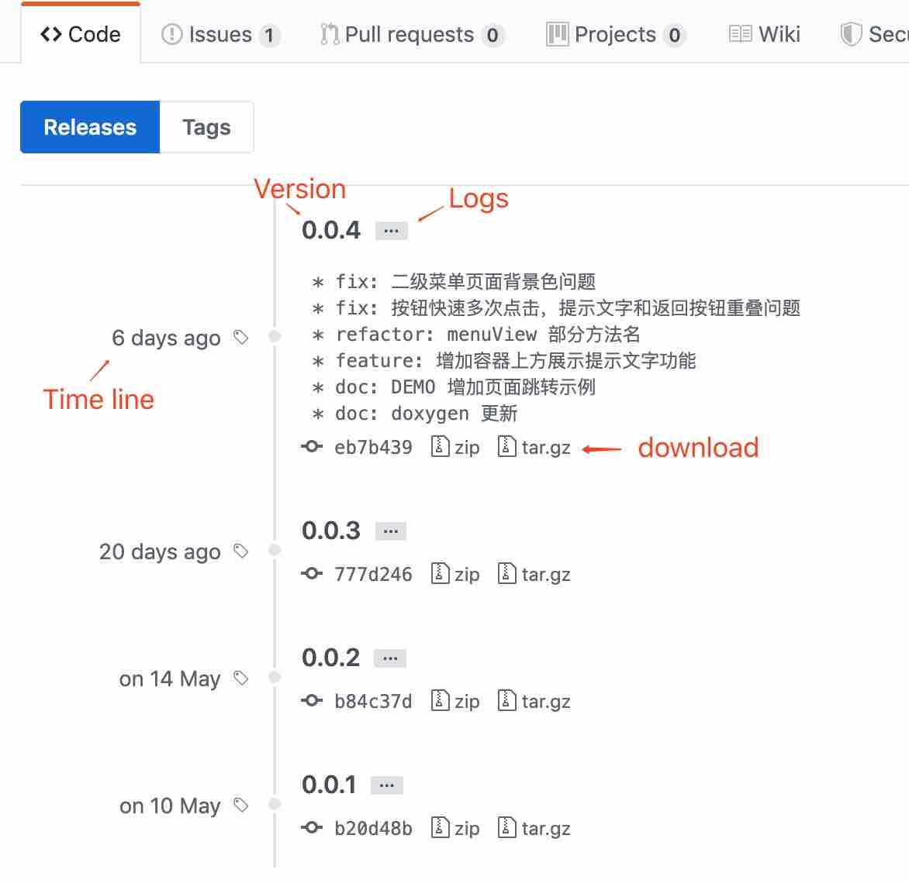
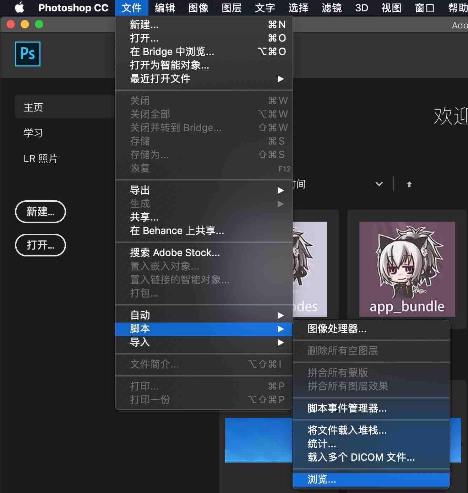
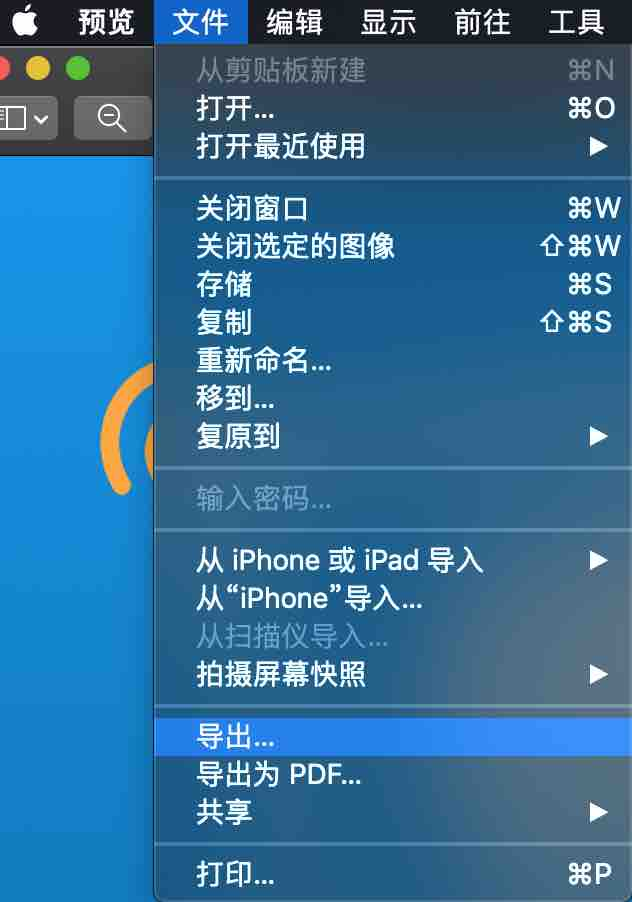
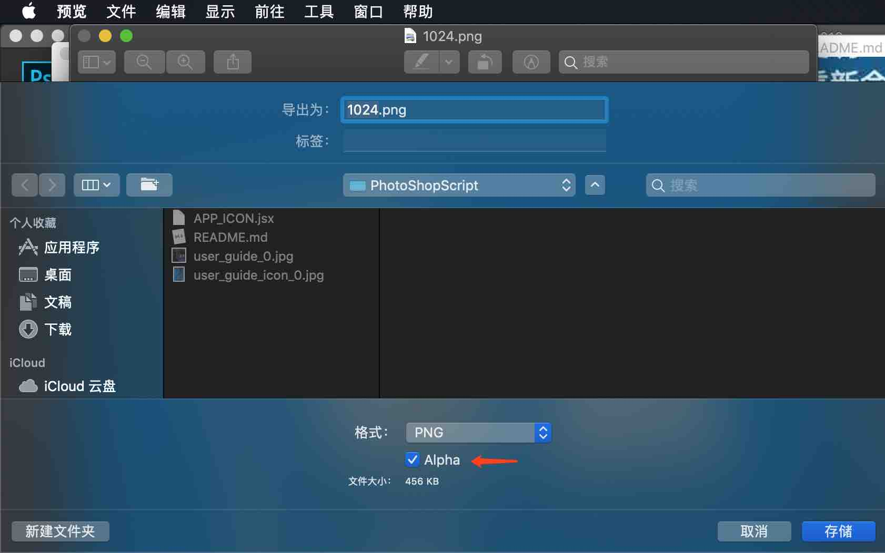

# PhotoShopScript

   

* [简单说明](#简单说明)
* [基础知识](#基础知识)
* [脚本使用](#脚本使用)
* [脚本介绍](#脚本介绍)
  * [APP_ICON.jsx](#app_iconjsx)
  * [APP_LaunchImage.jsx](#app_launchimagejsx)
* [开发资源](#开发资源)
* [LICENSE](#LICENSE)

### 简单说明

本仓库包含一些可以在 *PhotoShop* 上运行的脚本文件，可以为开发者和设计师提供相应的便利功能。

具体可以实现哪些功能，可以参见下方的 *脚本介绍* 章节。

### 基础知识

目前，所有本仓库的内容托管在[GitHub](https://github.com/)上，也就是您当前访问的网页，这是一个供全球程序开发者托管、交流与开发代码的社区平台。如果您是初次接触[GitHub](https://github.com/)的设计师，很可能会对全英文的页面和功能感到不知所措，所以在这里，我先提供最简单的实用知识：

* 在网页头部的右侧，找到绿色的 *Clone or download* 按钮。
* 按下 *Clone or download* 按钮，在弹出的对话框中选择*Download ZIP* 按钮。
* 选择您所需要保存的位置，按下*确认* 按钮。

如果网络访问顺畅，所有的内容，包括当前的这个说明文件，都会以压缩包的形式下载到您的电脑上。现在您已经可以不需要继续浏览[GitHub](https://github.com/)了，您可以在本地继续阅读说明，进一步来使用所需的功能。

> **注意**：使用这种方式下载的内容必定为最新版本，您可以用诸如开发版，Alpha 版，测试版等名词来定义它。这同时意味着，我们无法时刻保证开发版的内容必定完全可用。
>
> 如果要使用所谓的正式版，稳定版，发行版或 release 版，请阅读接下来的说明。

* **如果开发者又发布了新内容或者更新，我该怎么办？**

  一般情况下，您只需要关注正式版的版本更新。下面是相关的操作步骤：

  * 在网页头部的中间，找到并按下灰色的 *releases* 标签。

    

  * 您应该会看到类似于下图所示的一个新页面。在该页面中包含了所有的正式版本和相应信息，您可以根据自身需要来选择对应的版本进行下载，点击相应的 *zip 或 tar.gz* 图标即可下载对应的压缩包。

    

> **注意**：正常情况下，您应该使用正式版，并以正式版提供的功能为准。并非所有的 GitHub 项目都提供了 releases 版本，但本仓库不在此列。

> 目前的 *基础知识* 章节只为非开发者用户提供了最低限度的支持；
>
> *GitHub* 的功能远不止于此，您可以利用 *watch* 和 *Follow* 随时跟踪仓库和作者的变化，*Star* 来收藏仓库并表示对作者的点赞支持，*Issue* 来报告使用中遇到的问题，*clone* 和 *pull requests* 来参与该项目，或者 *fork* 进行您自己的二次开发，但这些并非本文应当说明的重点；
>
> 如果您对开发者的世界有所兴趣，可以先行利用搜索引擎自学相关的知识，作为一个逾千万开发者在使用的网站，使用它并不像您想象的那么复杂，祝您好运！

### 脚本使用

以在 *macOS Mojave 10.14.5* 系统上运行的 *Adobe PhotoShop CC 2019* 为例：

* 第一步，打开 *PhotoShop CC*。

* 第二步，从屏幕上方的菜单栏中找到 *文件* 选项卡，依次选择 *文件 -> 脚本 -> 浏览...* ，这一路径根据系统和应用版本不同可能会有所不同，如图所示：

  

* 最后，选择您想要运行的脚本文件，点击 *打开* ，根据脚本的指示完成后续操作。

* 举例：

  * 您需要快速生成 APP ICON 文件。
  * 在脚本介绍中，找到能实现该功能的脚本文件，在这里对应的是``APP_ICON.jsx``。
  * 按之前所述步骤，使用 *PhotoShop* 打开``APP_ICON.jsx``文件。

### 脚本介绍

* #### APP_ICON.jsx

  * **一句话说明**  

    * 快速生成所有尺寸的 APP ICON 文件。

  * **详细介绍**

    * 默认会一并输出 iOS 与 Android 的 ICON，Adnroid 的 ICON 文件名会以``ic_launcher``开头，iOS 的 ICON 文件名为纯数字。
    * 生成新文件时，会覆盖输出目录下的同名文件，建议新建一个文件夹来接收输出的文件。

  * **注意事项**

    * 对于 iOS 而言，截至``iOS 12.3.1  Xcode 10.2.1`` ，苹果上架审核要求 ICON 不需要自带圆角，并且不能有透明通道，但实践中我发现某些情况下 UI 设计工具设置正确，但输出的 png 可能依然包含 alpha，这里对于使用 *macOS* 系统的用户提供一种便捷的检查方式：

      * 第一步，双击 png 文件，使用 *macOS* 系统自带的 *预览* 程序打开图片。

      * 第二步，从屏幕上方的菜单栏中找到 *文件* 选项卡，依次选择 *文件 -> 导出...* ，如图所示：

        

      * 第三步，观察出现的页面中是否存在 alpha 选项，如图所示：

        

      * 如果出现了 alpha 选项，证明当前的 png 图片还存在透明通道，只需要将 alpha 选项的对勾去掉，并选择位置后点击 *存储* ，即可生成正确无误的 png 图片。

      * 如果没有出现 alpha 选项，则无需进行任何处理。

* #### APP_LaunchImage.jsx

  * **一句话说明**
    * 快速生成所有尺寸的 APP 启动页文件。
  * **详细介绍**
    * 默认输出 *iOS7.0 and Later* 的 *竖屏* 启动页文件，Android 所需的启动页尺寸一般能够同时满足。
    * 保存输出图片时，默认设置为 *png，24位，无交错* 。
    * 启动页内容默认的处理方式为 *等比缩放图层至新大小，直至图像较长的一边撑满画布* 。
    * 生成新文件时，会覆盖输出目录下的同名文件，建议新建一个文件夹来接收输出的文件。
  * **注意事项**
    * 由于目前对内容的处理方式为简单地按百分比大小等比缩放原始启动页的图层，未设置在低分辨率放大至高分辨率时的双三次插值等平滑算法，所以建议在内容可以满足需求时，向脚本优先传入较大尺寸的启动页，避免损失精度。
    * 简单缩放一般情况下只能在页面内容简单的时候表现良好，建议每次手动检查一下输出内容，避免视觉效果不满足要求。

### 开发资源

* [Adobe PhotoShop Scripting](https://www.adobe.com/devnet/photoshop/scripting.html)
  * 主要以 pdf 的形式提供 *Guide* 和 *Reference*，支持 *AppleScript*，*JavaScript* 和 *VBScript* 三种语言。

* [Adobe I/O](<https://www.adobe.io/>)
  * *Adobe* 重构并整合了它的资源，推出了一个新的开发者官网，其中主要分为 *Experience Platform* 和 *Adobe I/O Runtime* 两部分，而脚本与工具插件开发属于后者。

### LICENSE

[WTFPL](<http://www.wtfpl.net/about/>) – JUST DO WHAT THE F*CK YOU WANT TO DO.

